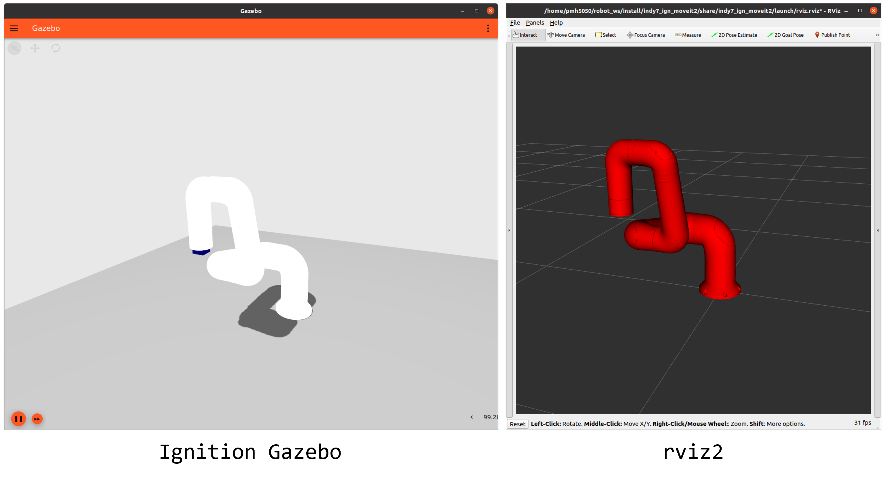
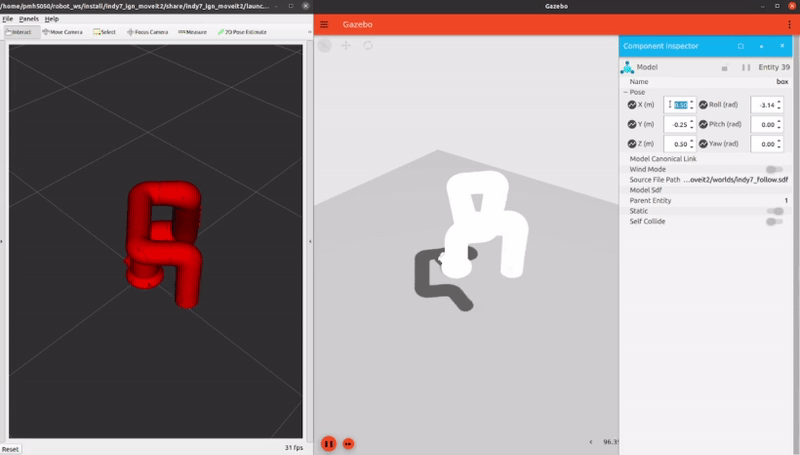

# indy7_ign_moveit2
This is a basic project to operate Indy7 in Ignition Gazebo environment using MoveIt2 interface.

## Dependency
- [ROS2 Foxy](https://docs.ros.org/en/foxy/Installation.html)
- [Ignition Fortress](https://ignitionrobotics.org/docs/fortress)
- [MoveIt 2](https://moveit.ros.org/)
  - [Binary Install](https://moveit.ros.org/install-moveit2/binary)
  - [Source Build(Recommend)](https://moveit.ros.org/install-moveit2/source/)
- [ros_ign](https://github.com/ignitionrobotics/ros_ign/tree/ros2)
- Ignition package for indy7
  - [indy7_ign](https://github.com/HYU-PBLRC-PB1/indy7_ign.git)
  - [indy7_moveit2_config](https://github.com/HYU-PBLRC-PB1/indy7_moveit2_config.git)

## Tip
In order not to repeatedly perform the personal access token authentication process of the private repository, 
it is recommended to run the following command.

```bash
git config --global credential.helper cache
git config --global credential.helper "cache --timeout=3600" # Cache the authenticated token for 3600 seconds
```

## Install & Build
Run the following command to download the package from the remote repository and install it in your colcon workspace.

```bash
mkdir -p ~/robot_ws/src # Make colcon workespace directory. If colcon workspace does not exist, run this command.
cd ~/robot_ws/src
git clone https://github.com/HYU-PBLRC-PB1/indy7_ign_moveit2.git # Download the package from the remote repository.
cd ~/robot_ws && colcon build --symlink-install # Build colcon workspace.
source ~/robot_ws/install/setup.bash
```

## Package Structure
If you want to check the file structure of a package, run the following command.
```bash
cd ~/robot_ws/src/indy7_ign_moveit2
tree
```

```bash
indy7_ign_moveit2
├── CMakeLists.txt
├── examples
│   ├── cpp
│   │   └── example_ign_moveit2.cpp
│   └── python
│       ├── example_follow_object_direct.py
│       ├── example_follow_object.py
│       ├── example_follow_object_wait_until_executed.py
│       ├── example_gripper.py
│       ├── example_joint_goal.py
│       ├── example_pose_goal.py
│       └── example_throw.py
├── include
│   └── indy7_ign_moveit2
├── launch
│   ├── examples
│   │   ├── example_cpp.launch.py
│   │   ├── example_follow_object_direct.launch.py
│   │   ├── example_follow_object.launch.py
│   │   ├── example_follow_object_wait_until_executed.launch.py
│   │   ├── example_throw.launch.py
│   │   └── worlds
│   │       ├── world_indy7_follow.launch.py
│   │       └── world_indy7_throw.launch.py
│   ├── ign_moveit2.launch.py
│   └── rviz.rviz
├── LICENSE
├── moveit2_py
│   └── moveit2.py
├── package.xml
├── README.md
├── src
└── worlds
    ├── indy7_follow.sdf
    └── indy7_throw.sdf

```

## Example1
Run the following command to execute the basic example file.
```bash
cd ~/robot_ws && source install/setup.bash
ros2 launch indy7_ign_moveit2 example_follow_object.launch.py
```


Change the position of the target (cube) using the MoveIt2 interface to check if the Indy7 follows the target well.

* In the launched Ignition Gazebo, click the ⋮ icon in the upper right corner.
* Enter component inspector and click on it.
* Click on the cube in the Ignition world.
* Change the Pose property in the component inspector.


The expected execution result is shown in the following figure.


## Example2


### Terminal 1
```bash
cd ~/robot_ws && source install/setup.bash
ros2 launch indy7_ign_moveit2 example_topic.launch.py 
```
### Terminal 2
```bash
ros2 topic pub --once /xyz_pose std_msgs/msg/String 'data: "-0.1 0.0 0.0"'
# wait for 5 seconds!
ros2 topic pub --once /xyz_pose std_msgs/msg/String 'data: "-0.1 0.0 0.0"'
# wait for 5 seconds!
ros2 topic pub --once /xyz_pose std_msgs/msg/String 'data: "0.1 0.0 0.0"'
```

### How does it work? (examples/python/example_topic.py)
```python
# base pose
self.latest_position = [0.25, 0.25, 0.25]
self.latest_quat = [1.0, 0.0, 0.0, 0.0]
```

```python
# msg.data = "-0.1, 0.0, 0.0"
# xyz_msg = ["-0.1", "0.0", "0.0"]
# xyz = [-0.1, 0.0, 0.0] 
xyz_msg = msg.data.split(' ')
xyz = [float(elem) for elem in xyz_msg]

self.latest_position[0] += xyz[0]       
self.latest_position[1] += xyz[1]
self.latest_position[2] += xyz[2]

self.moveit2_.set_pose_goal(self.latest_position, self.latest_quat)
# Plan and execute
self.moveit2_.plan_kinematic_path()
self.moveit2_.execute()
```

## Etc
Indy7's model currently spawned in Ignition Gazebo is spawned after downloading from [Fuel] https://app.ignitionrobotics.org/pmh5050/fuel/models/indy7), the shared storage of robot assets of 'Ignition Robotics'.

If there is a change in the remote repository ([Fuel](https://app.ignitionrobotics.org/pmh5050/fuel/models/indy7)), you must manually delete the indy7 model installed in the local device to apply it.

You can uninstall the indy7 model installed on the local device with the following command.
```bash
cd ~/.ignition/
rm -rf fuel
```
You can modify indy7's model file (sdf) by directly accessing the following path.
```
~/.ignition/fuel/fuel.ignitionrobotics.org/pmh5050/models/indy7
```
